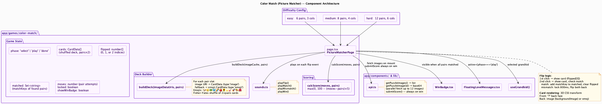
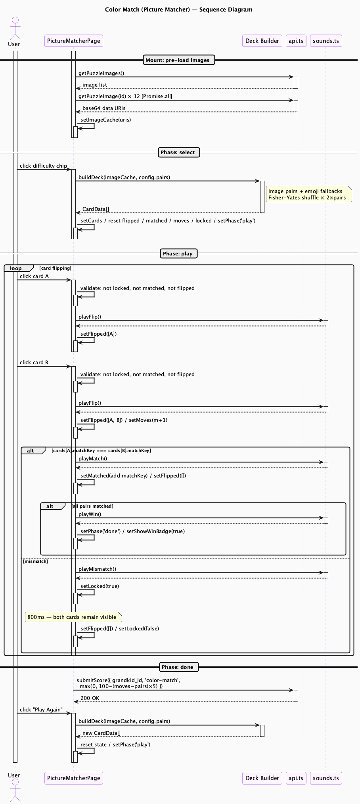

# Color Match Engine (Picture Matcher)

**Route**: `app/games/color-match/`
**Shared infrastructure**: [shared.md](shared.md)

---

## Component Map



The component diagram separates deck-building from flip logic. The "Deck Builder" is not a component — it is a pure function (`buildDeck`) called at the start of each game. The difficulty config boxes show that the three difficulty levels are plain data objects, not components or hooks. The `api.ts` arrow notes "always on win" — unlike Connect-4 and Slide Puzzle, Color Match has no conditional path that blocks score submission.

---

## Session Flow



The diagram is structured around the two-click flip pattern that defines the game.

**Mount** — Images are fetched in parallel (`Promise.all`) before the user reaches the select screen. `buildDeck` can therefore run synchronously when the user picks a difficulty with no loading delay mid-game.

**Card A click** — `setFlipped([A])` is a self-closing activation on Page (small nested bar), showing a synchronous state update with no downstream calls. Audio fires before state updates in all flip interactions.

**Card B click** — Moves into the `alt match / mismatch` decision. The match path clears `flipped` immediately. The mismatch path sets `locked`, waits 800ms (shown as a note on Page), then clears both. The two separate `activate Page / deactivate Page` pairs for `setLocked(true)` and `setFlipped([]) / setLocked(false)` are visibly distinct, reflecting that they happen at different points in time.

**Done** — Score submission is a `[-> Page` useEffect with no branching — it always reaches `api.ts`.

---

## State Machine

```
select  -->  play  -->  done
```

- **select**: Difficulty choice; deck built immediately on selection
- **play**: Active card flipping; `locked` prevents input during mismatch delay
- **done**: All pairs matched; score always submitted

---

## Difficulty Configuration

| Difficulty | Pairs | Columns | Grid shape |
|------------|-------|---------|------------|
| Easy | 6 | 3 | 3×4 |
| Medium | 8 | 4 | 4×4 |
| Hard | 12 | 6 | 6×4 |

---

## Card Representation

```typescript
interface CardData {
  id: number
  matchKey: string   // shared by the two cards in a pair
  type: 'image' | 'emoji'
  content: string    // base64 data URI or emoji character
}
```

Matching cards share the same `matchKey`. Image cards use `'img-N'`; emoji cards use the emoji character itself (e.g. `'🐶'`).

---

## Deck Building — `buildDeck(imageDataUris, pairs)`

1. Allocates `pairs * 2` card slots.
2. Fills slots with image pairs drawn from the preloaded cache (two cards per image, same `matchKey`).
3. Any slots beyond the cache size are filled with emoji pairs from a fixed 12-emoji list: `🐶🐱🐸🦋🌈🍎🌻⭐🎸🚀🎨🌺`.
4. Fisher-Yates shuffles the full deck.

Images are preloaded on mount via `Promise.all` over the first 12 puzzle images, preventing any loading delay when a game starts.

---

## Flip Logic

`flipped: number[]` holds 0, 1, or 2 card indices at any time. `locked: boolean` disables all card clicks during the 800ms mismatch delay.

**First click**
- Validate: not locked, not matched, not already flipped
- Play flip sound
- `setFlipped([A])`

**Second click**
- Validate: same checks
- Play flip sound
- `setFlipped([A, B])`, `setMoves(m + 1)`
- **Match** (`cards[A].matchKey === cards[B].matchKey`):
  - Play match sound
  - Add matchKey to `matched`, clear `flipped`
  - If `matched.size === config.pairs`: win
- **Mismatch**:
  - Play mismatch sound
  - `setLocked(true)` — 800ms pause
  - `setFlipped([])`, `setLocked(false)`

Cards animate with a 3D CSS flip transform. Front face shows "?"; back face shows the image or emoji.

---

## State Variables

| Variable | Type | Purpose |
|----------|------|---------|
| `phase` | `'select' \| 'play' \| 'done'` | Game phase |
| `cards` | `CardData[]` | Full shuffled deck |
| `flipped` | `number[]` | 0–2 currently face-up indices |
| `matched` | `Set<string>` | matchKeys of completed pairs |
| `moves` | `number` | Number of pair attempts |
| `locked` | `boolean` | Input disabled during mismatch delay |
| `imageCache` | `string[]` | Preloaded base64 URIs |
| `showWinBadge` | `boolean` | WinBadge visibility |

---

## Scoring Rules

- Score **always** submitted on win — no exceptions
- Formula: `max(0, 100 - (moves - pairs) * 5)`
  - Perfect play (one attempt per pair) → 100 pts
  - Each extra attempt costs 5 pts
  - 6 pairs, 6 moves → 100 pts
  - 6 pairs, 10 moves → 80 pts
  - 6 pairs, 26+ moves → 0 pts
