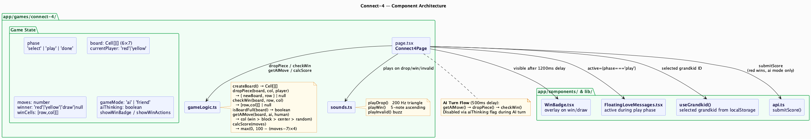
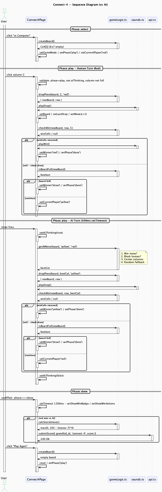

# Connect-4 Engine

**Route**: `app/games/connect-4/`
**Shared infrastructure**: [shared.md](shared.md)

---

## Component Map



The component diagram shows two distinct responsibility zones. The left zone contains everything specific to Connect-4: the page component, the grouped state variables, `gameLogic.ts` (pure board functions), and `sounds.ts`. The right zone shows the shared infrastructure — `WinBadge`, `FloatingLoveMessages`, `useGrandkid`, and `api.ts`. The arrows show the direction of dependency. Notably, `api.ts` is only reached at the end of a game (score submission), and only when red beat the AI.

---

## Session Flow



The sequence diagram traces a full vs-AI game across four phases:

**Select** — A single user click creates the board and sets the initial state. `createBoard()` is the only logic call needed.

**Human Turn** — Each column click fans out into three logic calls in order: `dropPiece` (place the piece), `checkWin` (test for victory), and conditionally `isBoardFull` (test for draw). Audio fires between drop and win check. The nested `activate Page / deactivate Page` bars on the setState calls show those updates completing synchronously before the next call.

**AI Turn** — Triggered by an internal 500ms `setTimeout` (shown as a `[->` found-message arrow from the left boundary — a spontaneous event with no external caller). The AI runs the same `dropPiece` / `checkWin` / `isBoardFull` sequence. `setAiThinking` gates human input for the duration.

**Done** — A `useEffect` watching `phase` triggers score calculation and submission. The 1200ms `setTimeout` for `showWinBadge` is a nested self-activation on Page, completing before the API call begins.

---

## State Machine

```
select  -->  play  -->  done
```

- **select**: Mode choice (vs Computer / vs Friend)
- **play**: Active game loop; `aiThinking` flag gates human input during AI turns
- **done**: Set on win or draw; WinBadge appears 1200ms later

---

## Board Representation

The board is a `Cell[][]` — a 6-row by 7-column 2D array where each cell is `'red' | 'yellow' | null`. Row 0 is the top, row 5 is the bottom. Pieces fall to the lowest empty row in a column.

```typescript
type Cell = 'red' | 'yellow' | null
type Board = Cell[][]   // [6][7]

const ROWS = 6
const COLS = 7
```

---

## Core Logic — `gameLogic.ts`

### `dropPiece(board, col, player)`
Scans the column from row 5 upward for the first `null` cell. Returns `{ newBoard, row }` or `null` if the column is full. Does not mutate the original board.

### `checkWin(board, row, col)`
Checks four directions from the just-placed piece: horizontal, vertical, and both diagonals. For each direction it walks up to 3 steps forward and 3 steps backward, counting consecutive same-color cells. Returns the four winning `[row, col]` positions or `null`. Only cells reachable from the placed piece are checked — O(1) regardless of board size.

### `isBoardFull(board)`
Checks only the top row (row 0). If every cell in row 0 is non-null the board is full.

### `getAIMove(board, aiPlayer, humanPlayer)`
Greedy one-ply strategy with four priority levels evaluated in order:

1. **Win** — any column that gives the AI a 4-in-a-row immediately
2. **Block** — any column that prevents the human from winning on their next turn
3. **Center preference** — columns scored by distance from center: `[3, 2, 4, 1, 5, 0, 6]`
4. **Random** — fallback when no strategic move exists

### `calcScore(moves)`
`max(0, 100 - (moves - 7) * 4)`

Par is 7 moves (theoretical minimum for red to win). Each move above par costs 4 points.

---

## State Variables

| Variable | Type | Purpose |
|----------|------|---------|
| `phase` | `'select' \| 'play' \| 'done'` | Game phase |
| `gameMode` | `'ai' \| 'friend'` | Opponent type |
| `board` | `Cell[][]` | 6×7 grid |
| `currentPlayer` | `'red' \| 'yellow'` | Whose turn |
| `moves` | `number` | Red's move count |
| `winner` | `'red' \| 'yellow' \| 'draw' \| null` | Result |
| `winCells` | `[number, number][]` | 4 winning positions |
| `aiThinking` | `boolean` | Disables clicks during AI turn |
| `showWinBadge` | `boolean` | Delayed WinBadge visibility |
| `showWinActions` | `boolean` | Delayed action button visibility |

---

## Move Counting

`moves` increments only on red's drops (human player). AI drops do not count. The counter resets on "Play Again" but persists through AI turns within a round.

---

## Win Display

The four winning cells receive a glow class. The turn indicator transitions to "[Color] Wins!" instead of hiding. `showWinBadge` and `showWinActions` both appear after 1200ms via a single `setTimeout` in a `useEffect` watching `phase`.

---

## Scoring Rules

- Score submitted only when **red wins** against the **AI**
- Friend mode and AI losses do not submit scores
- Formula: `max(0, 100 - (moves - 7) * 4)`
  - 7 moves → 100 pts
  - 12 moves → 80 pts
  - 32+ moves → 0 pts
