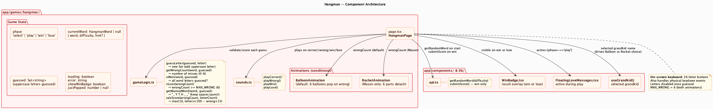
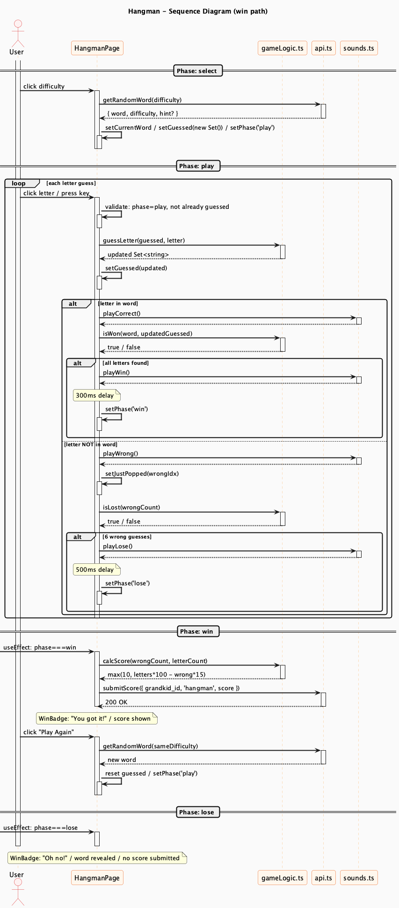

# Hangman Engine

**Route**: `app/games/hangman/`
**Shared infrastructure**: [shared.md](shared.md)

---

## Component Map



The component diagram highlights the conditional animation system. `BalloonAnimation` and `RocketAnimation` are siblings — which one renders is determined at runtime by checking the selected grandkid's name. Both receive only `wrongCount` as a prop and manage their own pop/detach animation internally. `gameLogic.ts` owns all word masking, guess validation, and win/loss detection; the page component never manipulates the word string directly. The `api.ts` box lists two methods because Hangman is the only game that calls the API during gameplay (word fetch) as well as at the end (score submit).

---

## Session Flow



The diagram shows the win path as the main flow, with the lose path as a separate terminal section at the bottom.

**Select** — An API call fetches a random word for the chosen difficulty. Word selection lives on the server; no local generation occurs.

**Play loop** — Every guess runs the same linear sequence: add the letter to `guessed`, play the correct/wrong sound, then check `isWon` or `isLost`. Both win and lose transitions include a short delay (`300ms` / `500ms`) — shown as a note on Page before `setPhase` fires — giving the final animation frame time to render.

**Win** — A `[-> Page` found-message useEffect picks up `phase === 'win'`, calculates the score, and submits it. The "Play Again" path reloads a word from the API.

**Lose** — A minimal `[-> Page` activation sets `showWinBadge`. No score is submitted. The word is revealed in the WinBadge.

The `Audio` participant never carries a return label — all sound calls return void, shown by the dashed return arrow with no text.

---

## State Machine

```
select  -->  play  -->  win
                   -->  lose
```

- **select**: Difficulty choice (easy / medium / hard)
- **play**: Active guessing; keyboard input enabled
- **win**: All letters found; score submitted
- **lose**: 6 wrong guesses reached; word revealed, no score

---

## Word Representation

Words come from `api.getRandomWord(difficulty)` as `{ word, difficulty, hint? }`. The word may contain spaces, hyphens, and apostrophes (e.g. `"GREAT BARRIER REEF"`). Non-letter characters are always visible; only letters are masked. `guessed` is a `Set<string>` of uppercase letters.

---

## Core Logic — `gameLogic.ts`

### `getMaskedWord(word, guessed)`
Iterates every character. Letters not yet in `guessed` become `_`; spaces and punctuation pass through unchanged. The display updates reactively whenever `guessed` changes.

### `getWrongCount(word, guessed)`
Counts letters in `guessed` that do not appear anywhere in the uppercased word. Non-letter characters in the word are excluded from this comparison.

### `isWon(word, guessed)`
Extracts only the letter characters from the word (uppercased, non-letter chars filtered out), then checks that every one is present in `guessed`.

### `isLost(wrongCount)`
`wrongCount >= MAX_WRONG` where `MAX_WRONG = 6`.

### `calcScore(wrongCount, wordLetterCount)`
`max(10, wordLetterCount * 100 - wrongCount * 15)`

A longer word with zero wrong guesses scores highest. The floor of 10 ensures every win awards some points.

---

## State Variables

| Variable | Type | Purpose |
|----------|------|---------|
| `phase` | `'select' \| 'play' \| 'win' \| 'lose'` | Game phase |
| `currentWord` | `HangmanWord \| null` | Active word + hint |
| `guessed` | `Set<string>` | Uppercase letters guessed so far |
| `loading` | `boolean` | Word fetch in progress |
| `showWinBadge` | `boolean` | WinBadge visibility |
| `justPopped` | `number \| null` | Index of animation element to pop |

---

## Animations

### BalloonAnimation (default)
Six colored balloons in a row. Each wrong guess applies a `balloonPopped` CSS class to the balloon at index `wrongCount - 1`, scaling it to zero.

### RocketAnimation (grandkid named Mason)
Six SVG rocket parts stacked vertically: nose, window, body, left fin, right fin, flame. A fixed `detachOrder` array maps wrong-guess index to part index so the rocket falls apart from the bottom up (flame first, nose last).

The active variant is chosen at render time: `selected?.name === 'Mason'` selects `RocketAnimation`, everything else uses `BalloonAnimation`.

---

## Input Handling

Letters are accepted from both the on-screen button grid and physical `keydown` events. Both paths call `handleGuess(letter)`, which validates `phase === 'play'` and that the letter is not already in `guessed` before processing. Guessed letters are disabled on the keyboard.

---

## Scoring Rules

- Score submitted only on **win**
- Lose path does not submit
- Formula: `max(10, wordLetterCount * 100 - wrongCount * 15)`
  - 6-letter word, 0 wrong → 600 pts
  - 6-letter word, 3 wrong → 555 pts
  - Any win → minimum 10 pts
