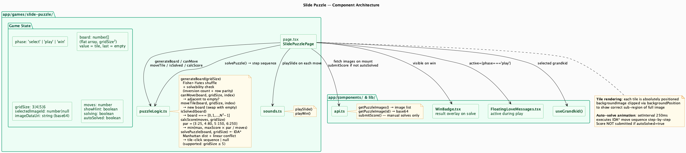
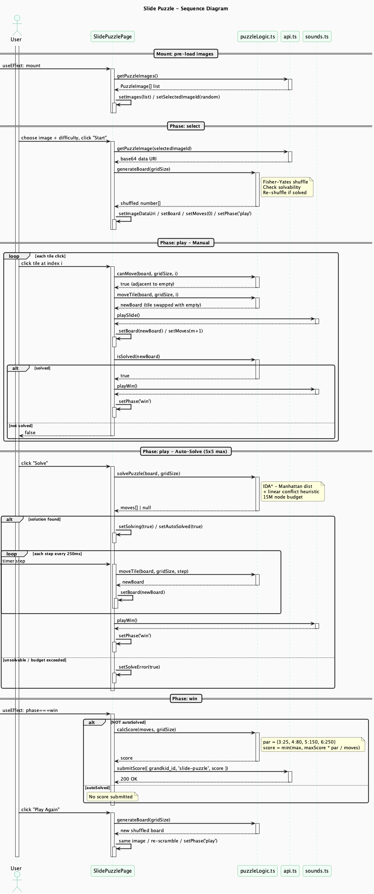

# Slide Puzzle Engine

**Route**: `app/games/slide-puzzle/`
**Shared infrastructure**: [shared.md](shared.md)

---

## Component Map



The component diagram draws attention to `puzzleLogic.ts`, the most complex logic module in the arcade. It owns three distinct responsibilities: shuffle with solvability guarantee, move validation, and the IDA* solver. The `autoSolved` flag — shown in the state group — is the single condition that blocks score submission, and the diagram makes that dependency explicit on the `api.ts` arrow. The hint system (`showHint`) and solve cancel (`solveCancelledRef`) appear in the state group to show they are purely UI state with no logic module involvement.

---

## Session Flow



The diagram covers three distinct ways a game session can play out:

**Manual play (main loop)** — Every tile click runs `canMove` then `moveTile` then `isSolved` in strict sequence. `isSolved` is only worth checking after a confirmed move. The `alt solved / not solved` block shows that the win path is the exception inside the loop body.

**Auto-solve** — After `solvePuzzle` returns the move sequence, the `[-> Page` timer arrows inside the `loop` block represent the 250ms `setInterval` ticks. Each tick runs a single `moveTile`. The loop is entirely Page-internal — User deactivated when the Solve button response was confirmed. The solve-complete block (an `activate Page` immediately after the loop) shows the final win state being set outside the timer.

**Win phase** — The `alt NOT autoSolved / else autoSolved` block makes the scoring rule visually explicit: the two paths diverge immediately and only one reaches `api.ts`.

---

## State Machine

```
select  -->  play  -->  win
```

- **select**: Image and difficulty selection; images pre-loaded on mount
- **play**: Active tile sliding; optionally show hint or trigger auto-solve
- **win**: Puzzle solved; score submitted unless auto-solved

---

## Board Representation

The board is a flat `number[]` of length `gridSize²`. The value at each index is the tile's identity (0 through `gridSize² - 2`), with `gridSize² - 1` representing the empty slot.

```
Solved state: [0, 1, 2, ..., gridSize² - 1]
Empty slot:   always the last value (gridSize² - 1)
```

Tiles are rendered with `position: absolute`, sized to `1/gridSize` of the board, and use `backgroundPosition` to clip their portion of the full image.

---

## Core Logic — `puzzleLogic.ts`

### `generateBoard(gridSize)`
Fisher-Yates shuffles the solved board. Solvability is verified by counting inversions (pairs where a higher-numbered tile precedes a lower-numbered one in the flat array) combined with the empty tile's row from the bottom. An unsolvable shuffle is discarded and retried. An accidentally solved board is also retried.

### `canMove(board, gridSize, tileIndex)`
Converts the flat index to `[row, col]` and the empty slot's flat index to `[emptyRow, emptyCol]`. A tile can move if `|row - emptyRow| + |col - emptyCol| === 1` (Manhattan distance of exactly 1, orthogonal only).

### `moveTile(board, gridSize, tileIndex)`
Returns a new array with the tile and empty slot swapped. Does not mutate the input.

### `isSolved(board)`
`board[i] === i` for all `i`. Returns on the first mismatch.

### `calcScore(moves, gridSize)`
Par values: `{ 3: 25, 4: 80, 5: 150, 6: 250 }`. Score is `min(maxScore, max(10, maxScore * par / moves))` — inversely proportional to move count, capped above and floored at 10.

### `solvePuzzle(board, gridSize)`
IDA* search with a two-part heuristic:

**Manhattan distance** — For each tile, the sum of horizontal and vertical distances from its current position to its goal position.

**Linear conflict** — For each row and column, if two tiles are both in their goal row/column but in the wrong order relative to each other, add 2 to the heuristic. This tightens the bound without making it inadmissible.

The combined heuristic is admissible and tighter than Manhattan distance alone, reducing the search space significantly for harder puzzles.

**Budget**: 15 million nodes. Returns `null` if exceeded (6×6 puzzles typically exceed this). Returns an ordered array of flat tile indices to click.

The page animates the solution at 250ms per step via `setInterval`, using `solveCancelledRef` to allow mid-solve cancellation.

---

## State Variables

| Variable | Type | Purpose |
|----------|------|---------|
| `phase` | `'select' \| 'play' \| 'win'` | Game phase |
| `board` | `number[]` | Flat tile array |
| `gridSize` | `3 \| 4 \| 5 \| 6` | Puzzle dimension |
| `selectedImageId` | `number \| null` | Chosen image |
| `imageDataUri` | `string` | Base64 image for tile rendering |
| `moves` | `number` | Manual move count |
| `showHint` | `boolean` | Reference image visibility |
| `solving` | `boolean` | Auto-solve animation in progress |
| `autoSolved` | `boolean` | Blocks score submission |
| `solveError` | `boolean` | Triggers error Snackbar |
| `showWinBadge` | `boolean` | WinBadge visibility |

---

## Difficulty Configuration

| Grid | Par | Max Score | Solver |
|------|-----|-----------|--------|
| 3×3 | 25 moves | ~100 pts | Supported |
| 4×4 | 80 moves | ~100 pts | Supported |
| 5×5 | 150 moves | ~100 pts | Supported |
| 6×6 | 250 moves | ~100 pts | Not supported (exceeds budget) |

---

## Hint System

For puzzles up to 5×5, a "Show Hint" button reveals the reference image beside the board. The Solve button is only available at 5×5 and below — 6×6 puzzles are excluded because `solvePuzzle` cannot reliably solve them within the 15M node budget.

---

## Scoring Rules

- Score **not** submitted if `autoSolved === true`
- Formula: `min(maxScore, max(10, maxScore * par / moves))`
  - Fewer moves than par → capped at maxScore
  - Moves at par → ~100 pts (scales with gridSize)
  - Moves well above par → approaches floor of 10
