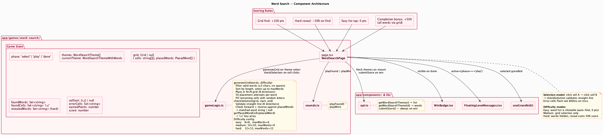
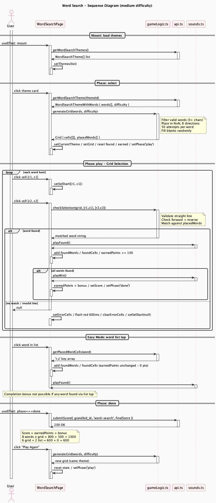

# Word Search Engine

**Route**: `app/games/word-search/`
**Shared infrastructure**: [shared.md](shared.md)

---

## Component Map



The component diagram shows four scoring rules as explicit dependency boxes — `+100 grid`, `-50% reveal`, `0 list tap`, `+500 bonus` — because the scoring system is the most differentiated part of the engine. The note on `gameLogic.ts` breaks down the grid generation algorithm step by step. The `api.ts` arrow has no conditional guard on submission, unlike Connect-4 (red must win vs AI) and Slide Puzzle (must not be auto-solved) — the score is always submitted when the phase reaches done.

---

## Session Flow



The diagram splits the play phase into four interaction modes to make the scoring rules visually distinct.

**Grid selection (main loop)** — Two separate user clicks form one selection attempt. The first click is a minimal Page activation (just `setSelStart`). The second click is where the work happens: `checkSelection` runs and the `alt word found / no match` block branches on its result. A failed selection shows the error-cell flash as a self-closing Page activation — a side effect with no downstream calls.

**Easy mode list tap** — Shown as a separate section to make the 0-point rule explicit. `getPlacedWordCells` is called to highlight the cells, but there is no `earnedPoints` update — the state activation bar simply does not appear for that update. Audio still fires.

**Hard mode reveal** — Not shown as a full section in the sequence diagram because it is a simple flag toggle with no downstream calls. Discussed in the scoring rules below.

**Done phase** — A `[-> Page` useEffect with no branching. The scoring note at the bottom gives worked examples to make the bonus math concrete.

---

## State Machine

```
select  -->  play  -->  done
```

- **select**: Theme selection; themes loaded on mount
- **play**: Active word hunting; three sub-modes (easy / medium / hard)
- **done**: All words found; score submitted

---

## Grid Representation

```typescript
interface PlacedWord {
  word: string
  startRow: number
  startCol: number
  direction: [rowDelta, colDelta]  // one of 8 directions
}

interface Grid {
  cells: string[][]        // N×N uppercase letters
  placedWords: PlacedWord[]
}
```

`cells` is the visual letter grid. `placedWords` is the placement manifest used by `checkSelection`.

---

## Difficulty Configuration

| Difficulty | Grid Size | Max Words |
|------------|-----------|-----------|
| Easy | 8×8 | 6 |
| Medium | 10×10 | 8 |
| Hard | 12×12 | 12 |

---

## Core Logic — `gameLogic.ts`

### `generateGrid(words, difficulty)`

1. Filters words: 3+ characters, no spaces, uppercase-convertible.
2. Sorts by length ascending — shorter words have more valid positions and place first.
3. Selects up to `maxWords` for the difficulty.
4. For each word, attempts up to 50 random `[startRow, startCol, direction]` combinations across all 8 directions. A position is accepted if every cell it would occupy is either empty or already holds the correct letter (valid overlaps are allowed).
5. Fills all remaining empty cells with random uppercase letters.

### `checkSelection(grid, start, end)`

Validates that `start` and `end` form a straight line by checking the absolute delta vector against the 8 valid directions: `[0,1]`, `[1,0]`, `[1,1]`, `[1,-1]`. Extracts the letter sequence in both forward and reverse directions, then compares against every `placedWord.word`. Returns the matched word string or `null`.

### `getPlacedWordCells(placedWord)`

Walks the word from its start position in its direction, returning each cell as a `'r,c'` string key. Used by easy mode to highlight found cells without going through `checkSelection`.

---

## State Variables

| Variable | Type | Purpose |
|----------|------|---------|
| `phase` | `'select' \| 'play' \| 'done'` | Game phase |
| `themes` | `WordSearchTheme[]` | Available theme list |
| `currentTheme` | `WordSearchThemeWithWords \| null` | Active theme + words |
| `grid` | `Grid \| null` | Generated letter grid |
| `foundWords` | `Set<string>` | Words successfully found |
| `foundCells` | `Set<string>` | Cell keys `'r,c'` of found words |
| `revealedWords` | `Set<string>` | Words revealed in hard mode |
| `selStart` | `[number, number] \| null` | First cell of current selection |
| `errorCells` | `Set<string>` | Cells flashed red on miss |
| `earnedPoints` | `number` | Running score before bonus |
| `score` | `number` | Final score with bonus |
| `showWinBadge` | `boolean` | WinBadge visibility |

---

## Difficulty Modes

The three modes differ not in grid complexity but in how the word list panel behaves:

**Easy** — The word list is clickable. Tapping a word auto-finds and highlights it at 0 points. No penalty for using this — but the completion bonus becomes unreachable the moment any word is found this way.

**Medium** — The word list is visible but not clickable. All words must be found on the grid.

**Hard** — Words are hidden behind buttons. Tapping a button reveals the word text (marks it as "revealed"). If the player then finds that word on the grid, it scores 50 points instead of 100. The reveal does not prevent the completion bonus on its own — only easy-mode list taps do.

---

## Scoring Rules

| Action | Points |
|--------|--------|
| Find word via grid selection | +100 |
| Find word that was previously revealed (hard mode) | +50 |
| Find word via easy-mode list tap | +0 |
| All words found via grid with no list taps | +500 bonus |

The completion bonus is tracked by `gridFoundCount`. If it equals `currentTheme.words.length` at game end, the +500 is applied. A single easy-mode list tap zeroes out the bonus for the entire session.

Score is always submitted on completion.

**Worked examples**:
- 8 words, all via grid → `800 + 500 = 1300 pts`
- 8 words, 6 grid + 2 list tap → `600 + 0 = 600 pts`
- 8 words on hard, 3 revealed then found, 5 clean → `(5 × 100) + (3 × 50) + 500 = 1150 pts`
